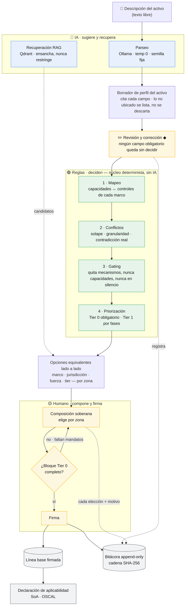

# Motor de armonización multi-marco

Un operador de infraestructura crítica describe un activo OT/IT/híbrido en texto libre y el motor
le ayuda a **componer de forma soberana** su línea base de ciberseguridad: la IA local sugiere y
recupera, un núcleo determinista decide, y el humano compone y firma —con una bitácora trazable de
punta a punta.

> **IA sugiere y recupera · las reglas deciden · el humano compone y firma.**
> Nada se restringe ni se borra en silencio. Reproducibilidad total: temperatura 0, semilla fija,
> modelo fijado, catálogo y mapeos versionados.

## El flujo, de un vistazo



**Cómo leerlo.** Cada color es un actor y la frontera entre ellos es innegociable: la IA (azul)
solo lee la descripción y recupera candidatos —nunca decide, ordena ni filtra—; las reglas (verde)
son deterministas y no tocan la IA; el humano (amarillo) es el único que elige y firma. La firma
está bloqueada hasta que el bloque obligatorio (Tier 0) esté completo, y **todo** —tanto lo que
decide el motor como lo que decide la persona— queda escrito en una bitácora que solo crece,
encadenada por SHA-256. El resultado firmado se puede exportar como declaración de aplicabilidad
(SoA) o como plan parcial OSCAL.

La contribución central está en el paso amarillo **Composición soberana**: no traduce un marco a
otro (A≈B, como haría un *crosswalk*), sino que pone las opciones equivalentes lado a lado y
**aconseja la selección** por zona.

## Arrancar

La primera vez —y después de cualquier cambio de código— hay que construir las imágenes de backend
y frontend:

```bash
make build
```

A partir de ahí, para arrancar reutilizando esas imágenes:

```bash
make up
```

| | URL |
| -- | -- |
| Aplicación | <http://localhost:8080> |
| Swagger — plan B declarado de la demo | <http://localhost:8000/docs> |

`make build` y `make up` detectan el hardware (NVIDIA → AMD → CPU) y levantan los cuatro
contenedores; la diferencia es que `make build` reconstruye las imágenes de backend y frontend y
`make up` reutiliza las ya construidas (por eso, sin haberlas construido antes, `make up` intenta
descargarlas y falla). `make help` lista el resto. **El primer arranque descarga ~5,8 GB**
(modelo + embeddings) y tarda 15–30 min; los siguientes, menos de un minuto. Componer, firmar, leer la
bitácora y el delta regional funcionan **sin IA**: lo único que espera al modelo es leer una
descripción.

## Probar la aplicación

Una sola vista, cinco pasos: **describir → revisar → elegir → comparar → firmar (con registro)**. Hay
cinco descripciones de ejemplo, de cinco sectores distintos, listas para pegar, y una guía de cómo
recorrerlas: **[docs/demo-playbook.md](docs/demo-playbook.md)**.

## API

Superficie **cerrada**: siete endpoints declarados como dato en `server/app/api/router.py`, y una
prueba (`tests/api/test_surface.py`) falla si aparece uno de más.

| Endpoint | Función |
| -- | -- |
| `POST /asset/parse` | Texto libre → borrador de `AssetProfile`, revisable |
| `POST /candidates` | Perfil → opciones equivalentes por capacidad y zona |
| `POST /baseline/compose` | Elecciones del humano → línea base firmada |
| `GET /baseline/{id}/audit-log` | Trazabilidad completa, con verificación de la cadena |
| `GET /baseline/{id}/statement` | Declaración de aplicabilidad (`?format=soa\|oscal`) |
| `POST /delta` | Delta regional para una zona del perfil |
| `GET /baselines` | Líneas base firmadas, de la más reciente a la más antigua |

## Más

Reglas del proyecto, invariantes, arquitectura, reproducibilidad por ruta de hardware y
convenciones de trabajo: **[CLAUDE.md](CLAUDE.md)**.

Anexos del trabajo de fin de máster, con el mapa que lleva de cada referencia `[A-N]` de la
memoria a la ruta donde el material vive: **[docs/anexos/README.md](docs/anexos/README.md)**.
